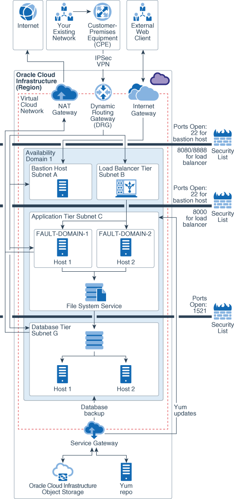
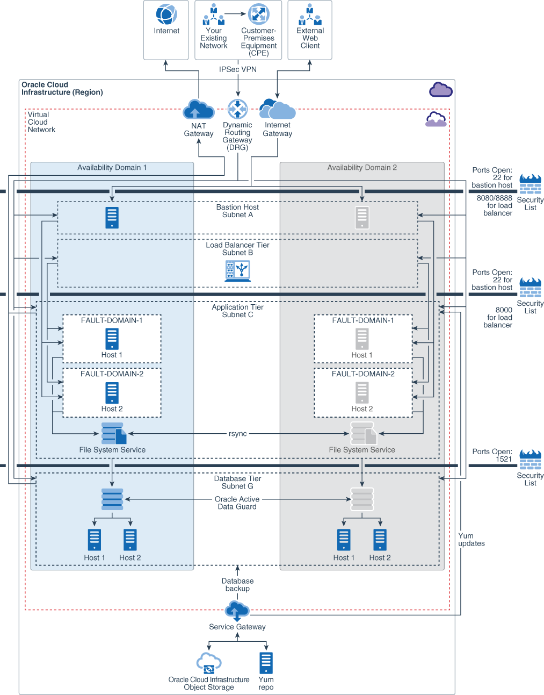

# **Terraform modules for Oracle E-Business Suite on Oracle Cloud Infrastructure**

The Terraform modules for Oracle E-Business Suite allow you to provision infrastructure for Oracle E-Business Suite on Oracle Cloud Infrastructure using Terraform. Oracle E-Business suite can be deployed on Oracle Cloud Infrastructure in single availability domain or multi availability domain architecture.The modules can be used to create infrastructure for Oracle E-Business Suite in single Availability Domain as well as multiple Availability Domains.

### **Architecture for Deploying Oracle E-Business Suite in a Single Availability domain**


### **Architecture for Deploying Oracle E-Business Suite in a multiple Availability domains**


For more information on Oracle E-Business Suite deployment architecture on Oracle Cloud Infrastructure, see
- [Architecture for Deploying Oracle E-Business Suite in a Single Availability domain](https://docs.oracle.com/en/solutions/deploy-ebusiness-suite-oci/index.html#GUID-1F8ACA7B-C147-446F-A4A4-AD70E4ECCA66)
- [Architecture for Deploying Oracle E-Business Suite in Multiple Availability domains](https://docs.oracle.com/en/solutions/deploy-ebusiness-suite-oci/index.html#GUID-43B8797E-A2BD-4CA2-A4A9-0E19DB15DA3B)

## **Prerequisites**

First off you'll need to do some pre deploy setup.  That's all detailed [here](https://github.com/oracle-quickstart/oci-prerequisites).
A terraform version of 0.11.x is required.

## **How to use this module**

### **Using OCI Resource Manager**

Follow Resource Manager steps [here](https://github.com/oracle-quickstart/oci-ebs/tree/master/orm) 

### **Using Terraform**

1) Clone the repo

  ```
  $ git clone https://github.com/oracle-quickstart/oci-ebs.git
  $ cd oci-ebs
  ```

2) Update **env-vars** with the required information. The file contains definitions of environment variables for your Oracle Cloud Infrastructure tenancy.

3) Update **terraform.tfvars** with the inputs for the architecture that you want to build. A running sample terraform.tfvars file for multiple availability domain architecture is available below. The contents of sample file can be copied to create a running terraform.tfvars input file. Update db_admin_password with actual password in terraform.tfvars file.

4) Initialize Terraform. This will also download the latest terraform oci provider.


  ```
  $ terraform init
  ```

5) Set environment variables by running source **env-vars**.

  ```
  $ source env-vars
  ```

6) Run terraform plan.

  ```
  $ terraform plan
  ```

7) Run terraform apply to create the infrastructure.

  ```
  $ terraform apply
  ```
 
  When you’re prompted to confirm the action, enter **yes**.

  When all components have been created, Terraform displays a completion message. For example: Apply complete! Resources: 47 added, 0 changed, 0 destroyed.


8) If you want to delete the infrastructure, run:

  ```
  $ terraform destroy
  ```

  When you’re prompted to confirm the action, enter **yes**.

## **Oracle E-Business Suite Terraform modules structure**

Terraform modules for Oracle E-Business Suite has the following structure:

```
.
├── datasources.tf
├── _docs
│   ├── multiple_availability_domain_ha_topology.png
│   └── single_availability_domain_ha_topology.png
├── env-vars
├── LICENSE.txt
├── main.tf
├── modules
│   ├── bastion
│   │   ├── bastion.outputs.tf
│   │   ├── bastion.tf
│   │   └── bastion.vars.tf
│   ├── compute
│   │   ├── compute.blockvolume.tf
│   │   ├── compute.data.tf
│   │   ├── compute.outputs.tf
│   │   ├── compute.rsync-remote-exec.tf
│   │   ├── compute.tf
│   │   ├── compute.variables.tf
│   │   ├── fss.tf
│   │   └── userdata
│   │       ├── bootstrap.tpl
│   │       └── rsync.sh
│   ├── dbsystem
│   │   ├── db.datasources.tf
│   │   ├── db.dbsystem.tf
│   │   └── db.variables.tf
│   ├── loadbalancer
│   │   ├── lb.tf
│   │   └── lb.variables.tf
│   └── network
│       ├── subnets
│       │   ├── subnets.outputs.tf
│       │   ├── subnets.tf
│       │   └── subnets.variables.tf
│       └── vcn
│           ├── vcn.data.tf
│           ├── vcn.outputs.tf
│           ├── vcn.tf
│           └── vcn.vars.tf
├── orm
│   ├── dist
│   ├── orm_generate_zip.tf
│   └── README.md
├── outputs.tf
├── provider.tf
├── README.md
├── routetables.tf
├── schema.yaml
├── seclists.tf
├── terraform.tfvars
└── variables.tf

12 directories, 40 files

```

- [**root**]:
  - [env-vars]: This is an environment file to set terraform environment variables on UNIX systems.
  - [datasources.tf]: This is terraform data source file to fetch data for Oracle Cloud Infrastructure resources.
  - [main.tf]: At root level, main.tf calls different modules to create Oracle Cloud Infrastructure resources. 
  - [outputs.tf]: This is the terraform outputs file.
  - [provider.tf]: This is the terraform provider file that defines the provider (Oracle Cloud Infrastructure) and authentication information.
  - [variables.tf]: This is the terraform variables file to declare variables.
  - [routetables.tf]: This file creates route tables.
  - [seclists.tf]: This file creates security lists.
  - [terraform.tfvars]: This is an input file to pass values to declared variables.

- [**modules**]: The modules directory contain all the modules required for creating Oracle Cloud Infrastructure resources.
  - [bastion]: This module is used to create bastion hosts.
  - [compute]: This module is used  to create unix and windows compute instances.
  - [dbsystem]: This module is used to create Oracle Cloud Infrastructure database system.
  - [loadbalancer]: This module is used to create Oracle Cloud Infrastructure load Balancing service.
  - [network]: This module is used to create network resources like VCN (Virtual Cloud Network),subnets, internet gateway, service gateway, dynamic routing gateway and NAT (network Address Translation) gateway.
    - [vcn]: This sub module creates the VCN, internet gateway, service gateway, dynamic routing gateway and NAT gateway.
    - [subnets]: This sub module creates the subnets within a VCN.

- [**orm**]: For OCI Resource Manager
  - [orm_generate_zip.tf]: This is used to create a zip file for OCI Resource Manager Stack.

## **Inputs required in the terraform.tfvars file**

The following inputs are required for terraform modules:

| Argument                   | Description                                                                                                                                                                                                                                                                                                                                                       |
| -------------------------- | ----------------------------------------------------------------------------------------------------------------------------------------------------------------------------------------------------------------------------------------------------------------------------------------------------------------------------------------------------------------- |
| AD                         | Availability Domain for Oracle E-Business Suite Deployment. This variable drives the Oracle E-Business Suite architecture to be deployed. Setting AD = ["1"] deploys infrastructure in single availability domain (Availabilty domain 1 of the tenancy) and AD = ["1","2"] deploys infrastructure in multiple ADs (Availability domains 1 and 2 of the tenancy). |
| vcn_cidr                   | CIDR block of the VCN (Virtual Cloud Network) to be created.                                                                                                                                                                                                      |
| vcn_dns_label              | DNS Label of the VCN (Virtual Cloud Network) to be created.                                                                                                                                                                                                                                                                                                                               |
| linux_os_version           | Operating system version of Oracle Linux for compute instances. The terraform module for compute instances always pick up the latest image available for the chosen Oracle Linux version in the region.                                                                            |
| timezone                   | Timezone of compute instances and database systems.                     |                                                                                     
| ebs_env_prefix                 | Environment prefix to define names of Oracle Cloud infrastructure resources. |                                                                                                                                                                                                                                                             
ebs_app_instance_count     | Number of Oracle E-Business suite application instances to be created. For single availability domain architecture, the application instances will be provisioned in round robin fashion across multiple fault domains. For multiple availability domain architecture, application instances will be provisioned in round robin fashion across fault domains and availability domains|                                                                   
| ebs_app_instance_shape         | Shape of application instance. For more information on available shapes, see [VM Shapes](https://docs.cloud.oracle.com/iaas/Content/Compute/References/computeshapes.htm?TocPath=Services#vmshapes)  |                                                                                                                                                                                                                 
| ebs_app_boot_volume_size_in_gb | Size of boot volume in gb for application compute instance.|
| ebs_app_block_volume_size_in_gb | Size of block volume in gb for application compute instance.|                                                                                                                                                                                                                                                                                                            
| ebs_app_block_volume_vpus_per_gb |  Block volume VPUs per GB. |                                                                                                                                                                                        
| ebs_app_block_volume_mount_path | Mount path for Oracle E-Business Suite application non shared filesystem. For example /u02.|                                                                                                                                                                                                                                                                                                                                                                 
| ebs_app_instance_listen_port   | Port on which Oracle E-Business Suite application instance will listen and receive requests from Oracle Cloud Infrastructure Load Balancing Service.|                                                                                                                                                                                                                                                                                             
| ebs_shared_filesystem_mount_path | Mount path for Oracle E-Business Suite application shared filesystem. For example /u01/install/APPS.|                                                                                                                                                                                                                                                                                     
| ebs_shared_filesystem_size_limit_in_gb | Soft upper limit for Oracle E-Business Suite application filesystem. This value is defined just to set an upper soft size limit visible to Oracle E-Business Installation tools. It does not restrict storage size of File Storage Service. |                                                                                                                                                                                                                                                                                    
| ebs_database_required           | Whether to create database. The value can be “true” or “false”|                                                                                                                                                                                                                                                                                                                                    
| db_edition                 | Edition of database.     
| db_license_model           | Licensing model for database.|                                                                                                                                                                                                                                                                                                                                     
| db_version                 | Version of database. |                                                                                                                                                                                                                                                                                                                                             
| db_node_count              | Number of database nodes. For single instance database, this parameter should be 1 and for Real Application Cluster Database, this parameter should be set to 2. |                                                                                                                                                                                                
| db_instance_shape          | Shape of Database nodes. For RAC, the minimum required shape is VMStandard2.1. |                                                                                                                                                                                                                                                                                     
| db_name                    | Name of Database Container. |                                                                                                                                                                                                                                                                                                                                                   
| db_size_in_gb              | Size of database in gb. For more information, see [Oracle Cloud Infrastructure Images](https://docs.cloud.oracle.com/iaas/images/)    |                                                                                                                                                                                                                                  
| db_admin_password          | Database administration password (sys password). |                                                                                                                                                                                                                                                                                                                   
| db_characterset            | Characterset of database. |                                                                                                                                                                                                                                                                                                                                        
| db_nls_characterset        | National Characterset of database.  |                                                                                                                                                                                                                                                                                                                                                                                                                                                                                                                                                                                                                                                                        
| db_pdb_name                | Starter Pluggable database name.     
| load_balancer_private      | Whether public or private load balancer. |                                                                                                                                                                                                                                                                                                                                                                                                                                                                                                                                                                                                                                                                       
| load_balancer_hostname     | Hostname of the load balancer.|                                                                                                                                                                                                                                                                                                                                    
| load_balancer_shape        | Shape of the load balancer. |                                                                                                                                                                                                                                                                                                                                      
| load_balancer_listen_port  | Listen port of the load balancer.  |                                                                                                                                                                                                                                                                                                                               

##### **Sample terraform.tfvars file to create Oracle E-Business Suite infrastructure in multiple availability domain architecture**

```hcl
# AD (Availability Domain to use for creating EBS infrastructure) 
# For single AD regions (ap-seoul-1, ap-tokyo-1, ca-toronto-1), use AD = ["1"] 
AD = ["1"]

# CIDR block of VCN to be created
vcn_cidr = "172.16.0.0/16"

# DNS label of VCN to be created
vcn_dns_label = "ebsvcn"

# Operating system version to be used for application instances. e.g  6.10 or 7.6
linux_os_version = "7.7"

# Timezone of compute instance
timezone = "America/New_York"

#Environment prefix to define name of resources
ebs_env_prefix = "dev"

# Number of application instances to be created
ebs_app_instance_count = "1"

# Shape of app instance
ebs_app_instance_shape = "VM.Standard2.2"

# Boot volume size 
ebs_app_boot_volume_size_in_gb = "100"

# Block volume size
ebs_app_block_volume_size_in_gb = "100"

# Block volume performance 
ebs_app_block_volume_vpus_per_gb = "0"

# Mount path for local application filesystem
ebs_app_block_volume_mount_path = "/u02"

# Listen port of the application instance
ebs_app_instance_listen_port = "8000"

# Mount path for shared application filesystem
ebs_shared_filesystem_mount_path = "/u01/install/APPS"

# Shared application filesystem size limit
ebs_shared_filesystem_size_limit_in_gb = "500"

# Whether database is required to be created
ebs_database_required = "true"

# Datbase Edition
db_edition = "ENTERPRISE_EDITION_EXTREME_PERFORMANCE"

# Licensing model for database
db_license_model = "LICENSE_INCLUDED"

# Database version
db_version = "12.1.0.2"

# Number of database nodes
db_node_count = "1"

# Shape of Database nodes
db_instance_shape = "VM.Standard2.1"

# Database name
db_name = "EBSCDB"

# Size of Database
db_size_in_gb = "256"

# Database administration (sys) password
db_admin_password = "<password>"

# Characterset of database
db_characterset = "AL32UTF8"

# National Characterset of database
db_nls_characterset = "AL16UTF16"

# Pluggable database name
db_pdb_name = "DUMMYPDB"

# Whether private Load Balancer
load_balancer_private = "True"

# Hostname of Load Balancer
load_balancer_hostname = "ebs.example.com"

# Shape of Load Balancer
load_balancer_shape = "100Mbps"

# Listen port of load balancer
load_balancer_listen_port = "80"
```

If you want to deploy Oracle E-Business Suite on Oracle Cloud Infrastructure in single availability domain architecture, set AD variable to one of the availability domain i.e. 1, 2 or 3. 

```hcl
AD = ["1"]
```

## **Information about Oracle Cloud Infrastructure resources built by Terraform modules for Oracle E-Business Suite**

* The terraform modules creates vcn with regional subnets for each tier. The subnet for bastion host is a public subnet, the subnet for database and application tier is a private subnet. The subnet for load balancer tier is either private or public depending on whether "load_balancer_private" input variable is True or False. When set to True, the subnet for Load balancer is private and when set to False, the subnet for Load balancer is public.

* It is recommended to use shared filesystem for Oracle E-Business Suite multi tier configuration. The Terraform modules create File Storage service filesystem for single as well as multiple availability domain architecture.  For a single availability domain architecture, a single filesystem is created. For multiple availability domain architecture, two such file systems are created, one in each availabilty domain. In addition to shared FSS filesystem, the terraform code also creates a block volume on each application compute node for any non shared application files.

* The shared FSS filesystems can be synchronized by an rsync script in cron. The rsync snchronization script is placed in cron of root user and is commented by default. The script can be enabled to synchornize fileystems after implemenation of Oracle E-Business Suite. 

  ```
  # Credits to lucas.gomes@oracle.com
  # crontab -l
  */30 * * * * /usr/bin/flock -n /var/run/fss-sync-up-file-system.lck rsync -aHAXxv --numeric-ids --delete /u01/install/APPS/ /u01/install/APPSDR/

  # cat /etc/cron.d/fss-sync-up-file-system
  */30 * * * * /usr/bin/flock -n /var/run/fss-sync-up-file-system.lck rsync -aHAXxv --numeric-ids --delete /u01/install/APPS /u01/install/APPSDR
  ```

* The Terraform modules provide option to create private as well as public load balancer using "load_balancer_private" input parameter.  When set to True, a private load balancer is created and when set to False, a public load balancer is created.The backend set of each load balancer has application servers added to it.

* Separate pairs of SSH keys can be used for bastion host and rest of the compute infrastructure resources. It is also possible to use the same key. In that case, same key is required as input to instance and bastion instance variables in env-vars.

  For example,
  ```
  ### Public/private keys used on the instance
  export TF_VAR_ssh_public_key=/home/oracle/tf/<mykey.pub>
  export TF_VAR_ssh_private_key=/home/oracle/tf/<mykey.pem>

  ### Public/private keys used on the bastion instance
  export TF_VAR_bastion_ssh_public_key=/home/oracle/tf/<mykey.pub>
  export TF_VAR_bastion_ssh_private_key=/home/oracle/tf/<mykey.pem>

  ```
  For terraform installations on Unix systems, the private half of SSH key pairs should be in OpenSSH format. The instances in private subnet can be reached via SSH on port 22 by allowing agent forwarding in Putty and using Putty authentication tool like Pageant. Note that this does not require copying private SSH key for instances to bastion host.

* The terraform modules ensure that application instances are deployed across different Fault Domains (in round-robin fashion) within an availability domain. Fault Domains protect against unexpected hardware failures and against planned outages due to compute hardware maintenance. For Real application clusters database also, each node of cluster is deployed in a separate Fault domain. 

* The terraform modules expose timezone variable which can be used to set timezone of provisioned compute instances and database systems. 

* The Terraform modules always use latest Oracle Linux image for the chosen operating system for provisioning compute instances. There are chances that minor version of operating system gets upgraded and a new image gets published in Oracle Cloud Infrastructure console. In that case, always check the available version of image from oracle Cloud Infrastructure compute console to input this value. For example, if Oracle Linux version is changed from version 7.5 to 7.6, change the value of input variable "linux_os_version" from 7.5 to 7.6.  

* For multi availability domain architcture, the standby database is built using OCI native dataguard association. The standby database is built in second availability configured in input parameter "AD"

* The terraform version has been locked to <0.12.0 and Oracle Cloud Infrastructure provider version has been locked to 3.70.0 in provider.tf file. To use a version higher than these versions, change the values in the provider.tf file. The terraform modules may require changes for a successful run with a new terraform and Oracle Cloud Infrastructure provider version. 


## **Cloud-init template for application servers**

Following is the cloud-init template used to install Oracle E-Business Suite prerequisite RPMs and mount shared file systems on application servers:

```yaml
#cloud-config
timezone: "${timezone}"

packages:
  - rsync
  - nfs-utils
  - ntp
  - oracle-ebs-server-R12-preinstall
  - fss-parallel-tools.x86_64

runcmd:
  - sudo mkdir -p ${src_mount_path}
  - sudo mount ${src_mount_target_private_ip}:${src_export_path} ${src_mount_path}
  - sudo chown oracle:oinstall ${src_mount_path}
  - echo ${src_mount_target_private_ip}:${src_export_path} ${src_mount_path} nfs tcp,vers=3 >> /etc/fstab
  # Run firewall command to enable to open ports
  - firewall-offline-cmd --port=${app_instance_listen_port}:tcp
  - firewall-offline-cmd --port=7001:tcp
  - firewall-offline-cmd --port=7002:tcp
  - firewall-offline-cmd --port=7201:tcp
  - firewall-offline-cmd --port=7202:tcp
  - firewall-offline-cmd --port=7401:tcp
  - firewall-offline-cmd --port=7402:tcp
  - firewall-offline-cmd --port=7601:tcp
  - firewall-offline-cmd --port=7602:tcp
  - /bin/systemctl restart firewalld
```

## **Unix bash commands to configure rsync on application servers**

These are the unix commands run to enable rsync across Oracle E-Business Suite application servers.

```
#Copyright © 2020, Oracle and/or its affiliates. All rights reserved.

#The Universal Permissive License (UPL), Version 1.0


#/bin/bash
sudo mkdir -p ${dst_mount_path}
sudo mount ${dst_mount_target_private_ip}:${dst_export_path} ${dst_mount_path}
sudo chown oracle:oinstall ${dst_mount_path}
sudo crontab /etc/cron.d/fss-sync-up-file-system
echo '${dst_mount_target_private_ip}:${dst_export_path} ${dst_mount_path} nfs tcp,vers=3' | sudo tee -a /etc/fstab
echo '#${fss_sync_frequency} /usr/bin/flock -n /var/run/fss-sync-up-file-system.lck rsync -aHAXxv --numeric-ids --delete ${src_mount_path} ${dst_mount_path}' | sudo tee -a /etc/cron.d/fss-sync-up-file-system
touch /tmp/rsync.done
```
